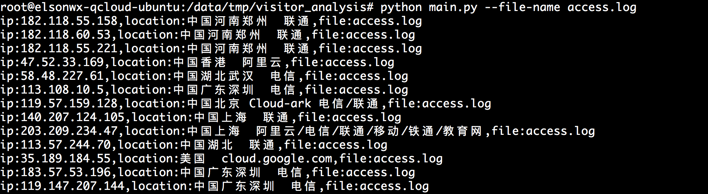

# visitor_analysis
analysis the visitor ip address from nginx log
# Usage
analysis the log file which has been modified in latest 5 days, the log filename must include "access" keywords
> python main.py -d 5 --file-name-keywords access

analysis single file

> python main.py --file-name access.log

analysis the log file which modified time between  20170601 and 20170630
> python main.py --start-date 20170601 --end-date 20170630 --file-name-keywords  access

if your nginx log file is not default  `/var/log/nginx`,  you need to specify the log directory explicitly

> python main.py --log-path /var/log/nginx_log_dir --file-name-keywords access

# Additional
for some reason you need to set some keywords to exclude some robot visit records.you can specify the log which is to be analysised that must include some keywords or exclude some keywords,to do that,you can change the script  line 19 and line 20.
```python
exclude_keywords = ['google','baidu','.aspx','spider','robots','gt-i9500']
include_keywords = ['www.elsonwx.com']
```
for use these two rules,you need to run
> main.py --enable-rule

#Example

